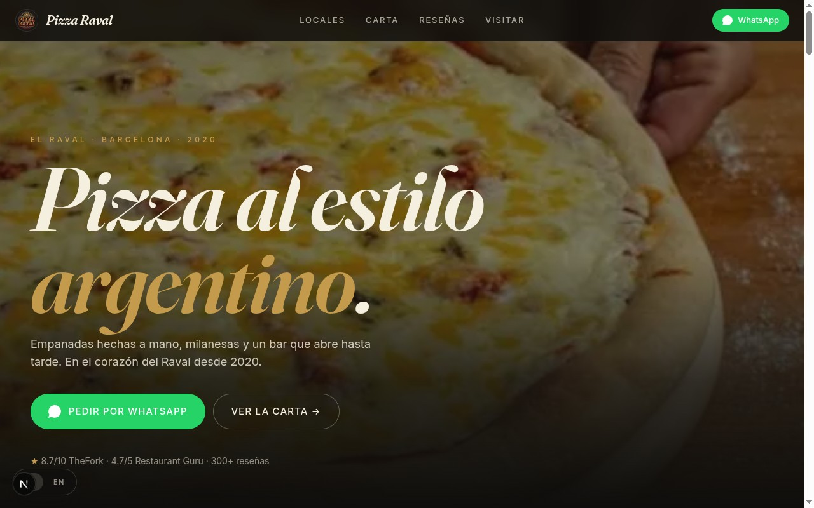
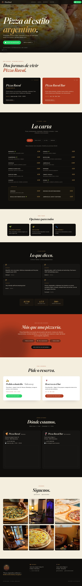

# Pizza Raval — Premium (Next.js)

The agency-level build. Next.js 15 App Router, TypeScript, Framer Motion, editorial cinematic direction. Generated via the `build-site` skill for post-conversion premium delivery.

## Highlights

- **Full-bleed photographic hero** with parallax-driven scale + tint as you scroll
- **Editorial italic display serif** (Fraunces 700 italic) — completely different language from quick-site's condensed Anton
- **Framer Motion choreography** — shared variants library, in-view triggered staggered reveals, AnimatePresence on tab swaps, magnetic CTAs
- **Structured menu data** — `lib/menu.ts` with typed `MenuItem[]` — change a price in one place, propagates everywhere
- **React Context i18n** — `useLang()` hook, ES/EN content toggle, localStorage-persisted
- **Optimized images** via `next/image` with priority hints and proper `sizes`
- **No flash of unstyled content** — language applied on the server-rendered HTML via context

## Run locally

```bash
cd pizza-raval-premium
npm install
npm run dev
# open http://localhost:3010
```

## Build for production

```bash
npm run build
npm run start
```

## Deploy to Vercel

```bash
vercel deploy --prod
```

(Or push this repo's `pizza-raval-premium/` folder as a Vercel project root.)

---

## Screenshots

### Hero — full-bleed photography + italic display serif

The first thing a prospect sees. Photo dominates, brand mark + italic serif headline sit on top, brass-accented eyebrow gives the editorial register. Compare to the quick-site's all-text bold-charcoal hero — entirely different visual language.



### Full page

Editorial section rhythm — bone (warm cream) ↔ ink (warm near-black) ↔ burnt-tomato. Menu uses a 2-column rolodex layout with brass italic prices and a callout box for *especiales*. Reviews use a 2×2 grid with oversized italic open-quote glyphs.



---

## Design brief

```
Style:    Editorial Cinematic — magazine-pizzeria.
          Full-bleed photography, asymmetric grid moments,
          generous whitespace. Less "loud street," more
          "Buenos Aires speakeasy + Italian trattoria heritage."

Palette:  ink      #0F0E0C   (near-black with warm undertone)
          bone     #F5EFE0   (warmer than the cream from quick-site)
          tomato   #B23B1F   (deeper, burnt)
          brass    #C49A4C   (warm metallic accent)
          olive    #5A6B3F   (subtle herb tone for veg badges)

Fonts:    Display → Fraunces 700 italic (display-italic font-variation tweaks)
          Heading → Inter Tight 500/600
          Body    → Inter 400/500

Motion:   Krehel-leaning production polish.
          - Hero: scroll-driven parallax scale + overlay opacity ramp
          - Sections: in-view fade-up with 80ms staggered children
          - Cards: 1px lift on hover, brass-tinted shadow
          - CTAs: btn-magnet class — subtle scale + brightness on hover
          - Tab swaps: AnimatePresence crossfade, 280ms
```

## Project structure

```
pizza-raval-premium/
├── app/
│   ├── layout.tsx          ← root layout, fonts, metadata, viewport
│   ├── page.tsx            ← composes all sections
│   └── globals.css         ← CSS variables, base styles, textures
├── components/
│   ├── Nav.tsx             ← sticky nav with logo
│   ├── Hero.tsx            ← parallax hero with useScroll
│   ├── Spots.tsx           ← two-location showcase
│   ├── MenuSection.tsx     ← tabbed menu, AnimatePresence
│   ├── ForEveryone.tsx     ← vegan / gluten-free / pet-friendly chips
│   ├── Reviews.tsx         ← 2×2 quote grid + rating blocks
│   ├── Events.tsx          ← red "más que una pizzería" section
│   ├── OrderReserve.tsx    ← two big CTA cards
│   ├── FindUs.tsx          ← both locations with maps
│   ├── FollowUs.tsx        ← Instagram-style 6-tile grid
│   ├── Footer.tsx          ← logo + tagline + locations
│   ├── SwitcherLang.tsx    ← floating ES/EN toggle
│   └── WhatsAppFloat.tsx   ← mobile sticky WhatsApp button
├── lib/
│   ├── i18n.tsx            ← LangProvider + useLang + <T es en>
│   ├── menu.ts             ← typed menu data from real PDFs
│   └── motion.ts           ← shared Framer Motion variants
├── public/assets/          ← photos, logo
├── tailwind.config.ts      ← color palette maps to CSS variables
├── next.config.ts
└── package.json
```

## Component contract

Bilingual content uses a small helper:

```tsx
import { T } from "@/lib/i18n";

<T es="Pedir por WhatsApp" en="Order on WhatsApp" />
```

Renders both spans; the active one shows via `html[lang="es"] [data-i18n="en"] { display: none }`. Works for strings or arbitrary JSX (the hero's mixed-color headline uses JSX inside `T`).

## Motion vocabulary

```ts
// lib/motion.ts
export const ease = [0.22, 1, 0.36, 1] as const;

export const fadeUp = {
  hidden: { opacity: 0, y: 16 },
  show:   { opacity: 1, y: 0, transition: { duration: 0.6, ease } },
};

export const stagger = (delayChildren = 0.05, staggerChildren = 0.05) => ({
  hidden: { opacity: 1 },
  show:   { opacity: 1, transition: { delayChildren, staggerChildren } },
});

export const inViewProps = {
  initial: "hidden",
  whileInView: "show",
  viewport: { once: true, amount: 0.05, margin: "0px 0px -10% 0px" },
} as const;
```

Every section uses the same vocabulary — keeps the motion language consistent across the page.

## What's NOT in here

- A CMS — copy is in components. For a marketing page that updates ~quarterly, hardcoded is fine. Add Sanity/Contentful later if needed.
- shadcn/ui — components are hand-rolled because the editorial direction wanted custom typography choices that fight shadcn's defaults.
- A theme switcher — premium gets ONE committed direction. (For variant pitching, see the sibling `pizza-raval/` quick-site, which has a 3-theme switcher.)
- Tests — no unit tests, no E2E. Marketing pages are visually-verified, not asserted.

## Known issues

- ⚠️ **One Framer Motion warning** in dev console — cosmetic SSR timing on `useScroll`. Doesn't affect production builds.
- 🔁 **Hero photo is `food-5.png`** — a generic pizza shot. For a real client deploy, swap with the owner's signature pizza or a Mario portrait.
- 🔁 **Logo is a JPG** — works but an SVG version would scale cleaner.

## Source

Same brief as the quick-site — see `../site_infos/pizza_raval_website_prompt.md`. Same menu PDFs. Different design direction (committed editorial vs the quick-site's swappable themes).
