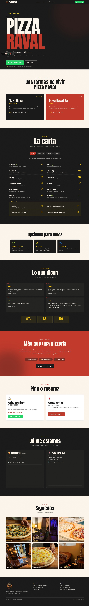
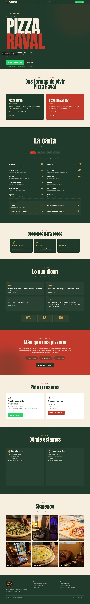
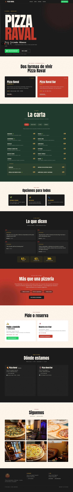
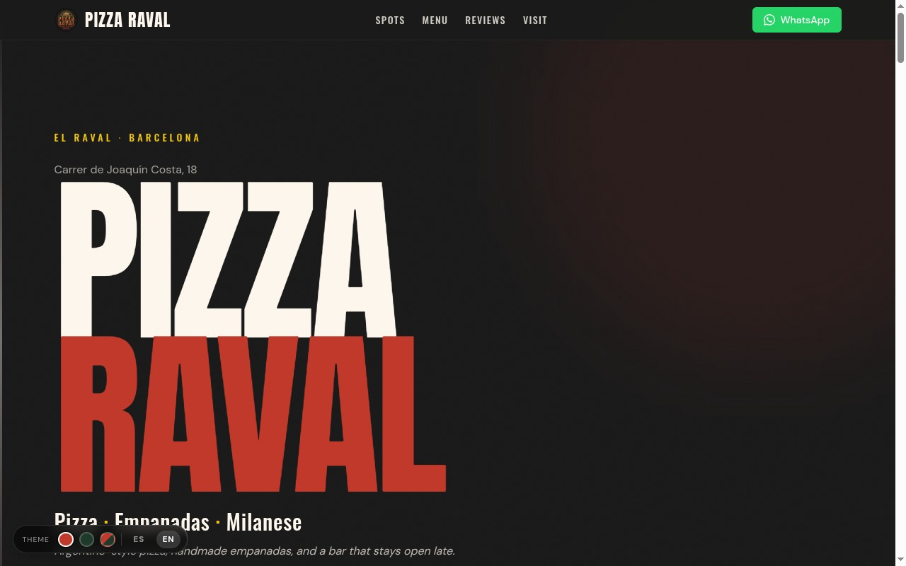

# Pizza Raval — Quick-site (Static)

The fast-pipeline build. Static HTML, Tailwind via CDN, Motion One for animations, no build step.

## Highlights

- **3 themes** you can switch live during a pitch: red (storefront identity), green (printed-menu identity), hybrid (red site + green menu section)
- **ES / EN content toggle** — every visible string has both languages, no half-translated lines
- **Real menu** from the May 2026 printed menu PDFs — 12 pizzas, 4 especiales, 9 appetizers, 3 burgers/milanesas, full drinks list
- **Real logo** wired into nav, footer, favicon
- **WhatsApp deep-links** with pre-filled messages for both takeaway and bar reservations
- **State persists** in localStorage so the choice sticks between visits

## Run locally

```bash
cd pizza-raval
python3 -m http.server 8000
# open http://localhost:8000
```

## Deploy

The folder is 100% static — drop it anywhere:

```bash
vercel deploy
# or
netlify deploy --dir=.
```

Cloudflare Pages, GitHub Pages, S3 — all work. No build step required.

---

## Screenshots

### Theme: red (storefront identity, default)

The Argentine-street-pizzeria direction — bold charcoal, tomato red, condensed Anton display type, gold accent for prices.



### Theme: green (printed-menu identity)

Forest green + warm parchment — matches what the owner uses on their actual printed menu. Calmer, more trattoria, less late-night-bar.



### Theme: hybrid (the agency move)

Red/charcoal everywhere except the menu section, which flips to green. Mirrors how a real brand uses different palettes for storefront vs print collateral — Eataly does this; classic NY pizzerias do this.



### English toggle

Same site, same data, fully translated. Pizza Raval gets significant tourist traffic in El Raval — bilingual is non-negotiable.



---

## How the switcher works

A floating widget at bottom-left:

```
[THEME] [🔴] [🟢] [🔴🟢]  |  [ES] [EN]
```

- Three theme dots flip CSS variables on `:root` instantly — no reload
- Hybrid is a partial override: `:root` stays red, `#menu` section scopes its own CSS variables to green
- ES/EN swaps `<html lang>`; CSS hides the non-active `[data-lang]` spans
- Both persist in `localStorage` and apply before first paint so there's no FOUC

## Stack

| Layer | What |
|---|---|
| Markup | Single `index.html`, ~530 lines |
| Styling | Tailwind via Play CDN + `styles.css` for components (no PostCSS, no build) |
| Motion | Custom IntersectionObserver for scroll reveals + CSS `@keyframes` for hero stagger. Vanilla, no library. |
| Fonts | Anton (display) + Oswald (heading) + DM Sans (body) via Google Fonts |
| Maps | Google Maps `output=embed` iframes |
| WhatsApp | Direct `wa.me` deep-links with URL-encoded message templates |

## What's NOT in here

- Build tooling, package manager, framework — intentional. This is the volume path.
- A CMS — copy is hardcoded. For 10/week cold-outreach, fastest is best.
- Server-side rendering — it's a static site, the HTML *is* the SSR output.
- The 3-theme switcher in the production deploy — typically you'd ship one committed theme to the actual client. The switcher exists for pitching.

## Source materials

The site was generated from a brief at [`../site_infos/pizza_raval_website_prompt.md`](../site_infos/pizza_raval_website_prompt.md) and the real menu PDFs in this folder (`Menu ESP - Mayo Ramblas Pizza Raval.pdf`, `Menu ING - Mayo Ramblas Pizza Raval-2.pdf`). Photos are from TheFork.
